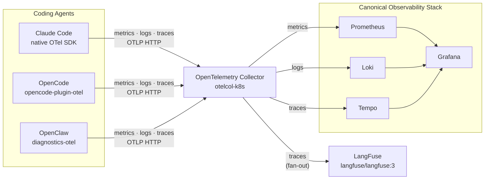

# Observability Architecture

This document describes the telemetry environment used to observe the three coding agents covered in this repository: Claude Code, OpenCode, and OpenClaw.

## Overview

All three agents emit OpenTelemetry signals (metrics, logs, traces) over OTLP HTTP to a central OpenTelemetry Collector. The collector fans signals out to the appropriate backends. Traces are sent to two independent backends — Tempo for general-purpose waterfall inspection, and LangFuse for LLM-centric session analysis.

## Components

### Coding agents

| Agent | Instrumentation | Signals |
|---|---|---|
| Claude Code | Native OTel SDK (built-in, no plugin) | Metrics · Logs · Traces |
| OpenCode | [`@devtheops/opencode-plugin-otel`](https://github.com/DEVtheOPS/opencode-plugin-otel) | Metrics · Logs · Traces |
| OpenClaw | [`@openclaw/diagnostics-otel`](https://docs.openclaw.ai/gateway/opentelemetry) | Metrics · Logs · Traces |

All three agents are configured with the same OTLP HTTP endpoint — the OpenTelemetry Collector — so no agent needs to know which backends are in use.

### Canonical Observability Stack (COS)

The [Canonical Observability Stack](https://charmhub.io/topics/canonical-observability-stack) is deployed on Kubernetes using Juju charms. It provides:

| Component | Charm | Role |
|---|---|---|
| OpenTelemetry Collector | `opentelemetry-collector-k8s` | Central OTLP ingestion and routing |
| Prometheus | `prometheus-k8s` | Metrics storage and query |
| Loki | `loki-k8s` | Log storage and query |
| Tempo | `tempo-coordinator-k8s` + `tempo-worker-k8s` | Distributed trace storage and query |
| Grafana | `grafana-k8s` | Unified dashboard and datasource hub |

The collector uses a tail-based sampler on the traces pipeline. Workload traces (agent sessions) are sampled at a configurable rate; for development, 100% sampling is recommended.

A second collector instance — the `opentelemetry-collector-integrator` charm — is used to inject an additional trace exporter into otelcol's config via the `external-config` relation. This is how the LangFuse fan-out is wired without modifying the core COS deployment.

### LangFuse

LangFuse is deployed via Docker Compose on the same host as COS, using the official [`langfuse/langfuse:3`](https://hub.docker.com/r/langfuse/langfuse) image (web) and `langfuse/langfuse-worker:3` (background worker). It receives traces from the same otelcol pipeline via an `otlphttp/langfuse` exporter, using Basic Auth against the LangFuse OTLP ingest endpoint (`/api/public/otel`).

LangFuse is a second trace backend, not a replacement for Tempo. It adds an LLM-centric session view on top of the same sampled trace data — see [telemetry-gaps.md](telemetry-gaps.md#what-langfuse-adds) for a comparison of what each backend surfaces.

## Architecture diagram

## Signal routing

| Signal | Source | Destination |
|---|---|---|
| Metrics | All three agents | Prometheus (via otelcol remote write) |
| Logs | All three agents | Loki (via otelcol) |
| Traces | All three agents | Tempo (primary) and LangFuse (secondary) |

Grafana queries Prometheus, Loki, and Tempo as datasources. LangFuse has its own UI and is queried independently.
