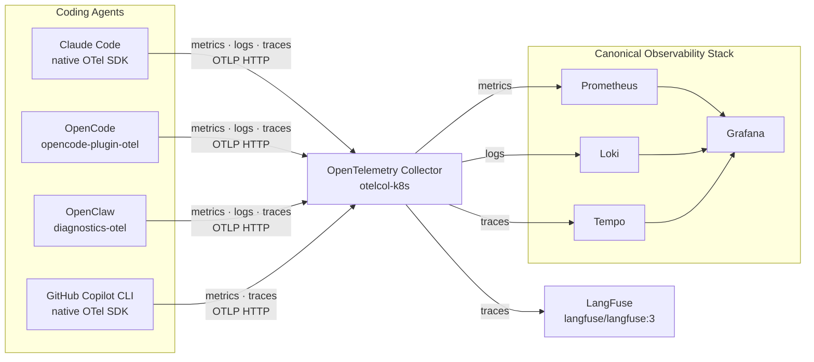

# The setup

Note:
This is the setup that I ended up using. I deployed Canonical Observability Stack using Juju alongside of an OpenTelemetry Collector and added a LangFuse container - I'll get back to this part later. OpenTelemetry Collector and Grafana were made accessible from all my devices using Tailscale, so I could connect multiple machines and VMs to send telemetry to a single backend.

What types of telemetry do the coding agents produce? In most cases, all of the signal trio are present: in all cases, metrics and traces were present (though for Claude Code they required setting a separate feature flag). Github Copilot did not send any logs, but its OpenTelemetry integration is so fresh it wasn't mentioned anywhere in the official docs - I found out about it by accident because it uses the same environment variables as OpenClaw. 