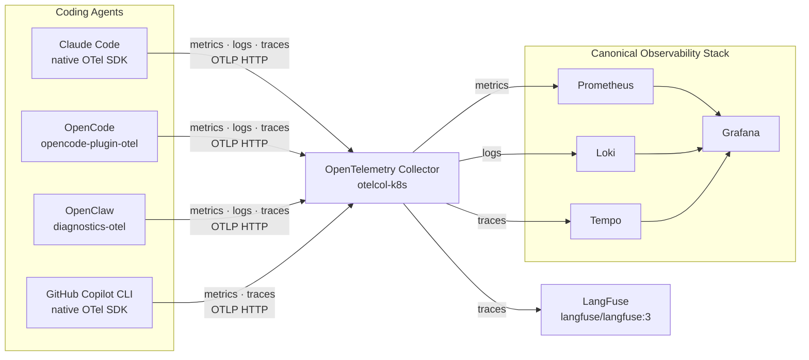

# The setup

Note:
This is the setup that I ended up using. I deployed Canonical Observability Stack using Juju alongside of an OpenTelemetry Collector and a LangFuse container - I'll get back to this part later. OpenTelemetry Collector and Grafana were made accessible from all my devices using Tailscale, so I could write up multiple machines and VMs to send telemetry.